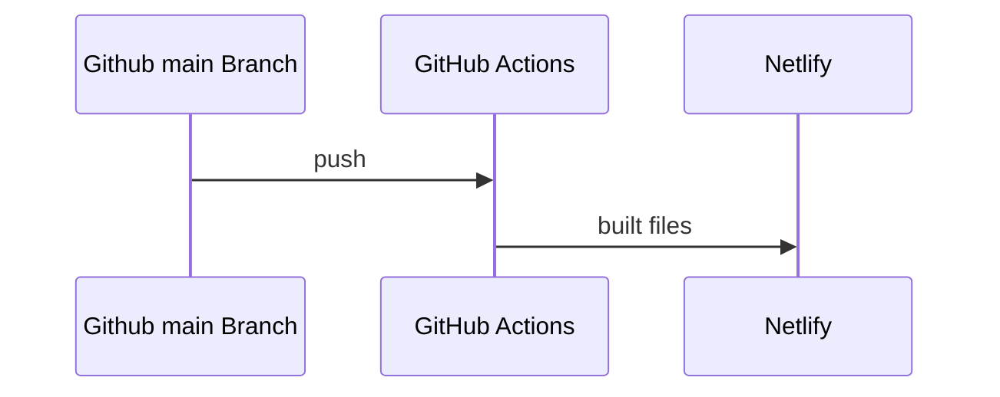

# Portfolio

Just a simple portfolio for different projects that have been worked on.

## 🚀 Live Sites

<!-- prettier-ignore -->
| Framework | Deploy Status | Live Site |
|-----------|---------------|-----------|
| **SvelteKit** |  | **[🔗 View Portfolio](https://tonyneuhold.com/)** |
| **React/Next.js** |  | **[🔗 View Portfolio](https://react.tonyneuhold.com/)** |

## Architecture

There are two versions of this portfolio with some shared code between them. Each app is developed and deployed separately on different domains.

- [Svelte portfolio code](./svelte)
- [React portfolio code](./react)

## Deployment Process

## Dev Setup

Overall, first run the installation command: `pnpm run i` in the root directory.

To start development for react:

- Run `pnpm react` in the root directory

To start development for svelte:

- Run `pnpm svelte` in the root directory
